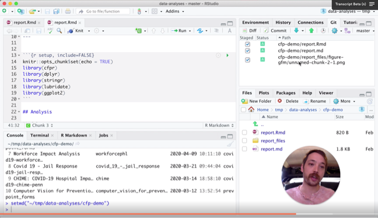

# data-analyses
For holding self-contained data analyses related to Code for Philly projects

## Getting started

### Install cfpr

See instructions in the [cfpr repo](https://github.com/codeforphilly/cfpr)

### Adding new analyses using RStudio

See this [10 minute walkthrough](https://www.loom.com/share/2a8d3c6a64c0449eada2b64d3bcbb5bb) below.

