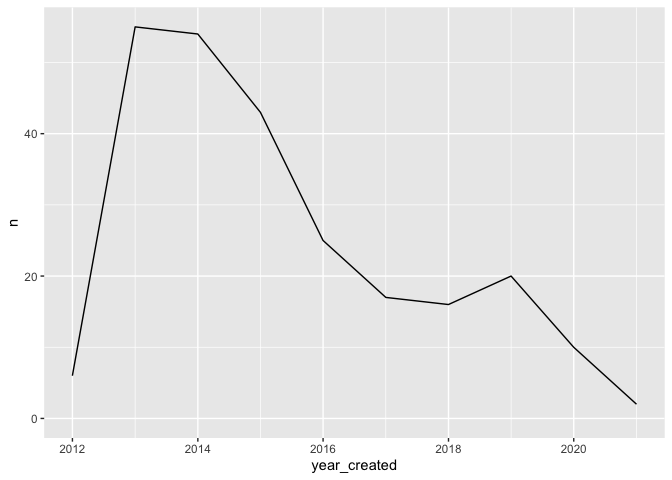

metrics
================

## Analysis

``` r
cfp_views_laddr_projects() %>%
  arrange(desc(created)) %>%
  head(10) %>%
  select(title, handle, created, chat_channel)
```

    ## # Source:     lazy query [?? x 4]
    ## # Database:   postgres [postgres@161.35.188.229:5678/datawarehouse]
    ## # Ordered by: desc(created)
    ##    title                 handle              created             chat_channel   
    ##    <chr>                 <chr>               <dttm>              <chr>          
    ##  1 RateMyNurse           ratemynurse         2021-01-17 13:38:30 ratemynurse    
    ##  2 Code for Philly Data… code_for_philly_da… 2021-01-05 15:59:16 cfp-dashboard  
    ##  3 Philly Auto and Paro… philly_auto_and_pa… 2020-09-21 15:33:41 phillyautoandp…
    ##  4 Malvern Recycling Re… willistown_townshi… 2020-07-26 18:33:59 <NA>           
    ##  5 Philadelphia Bail Fu… philadelphia_bail_… 2020-06-16 15:33:39 philadelphia-b…
    ##  6 Prevention Point For… prevention_point_f… 2020-05-04 16:17:36 prevpoint_forms
    ##  7 Workforce Impact Ana… workforcephl        2020-04-09 10:11:10 covid19-workfo…
    ##  8 Covid 19 - Jail Resp… covid_19_-_jail_re… 2020-03-21 09:44:04 covid19-jail-r…
    ##  9 CHIME: COVID-19 Hosp… chime               2020-03-14 18:58:10 covid19-chime-…
    ## 10 Computer Vision for … computer_vision_fo… 2020-03-12 13:52:54 prevpoint_forms

### How many projects get created per year?

``` r
# How many projects are created in a given month?
cfp_views_laddr_projects() %>%
  mutate(year_created = floor_date(created, "year")) %>%
  select(title, year_created) %>%
  count(year_created) %>%
  collect() %>%
  mutate(n = as.integer(n)) %>%
  ggplot(aes(year_created, n)) + geom_line() +
  expand_limits(y = 0)
```

<!-- -->
