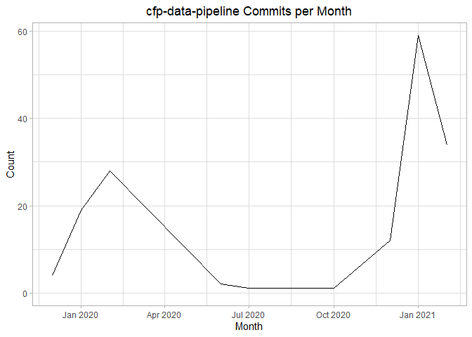
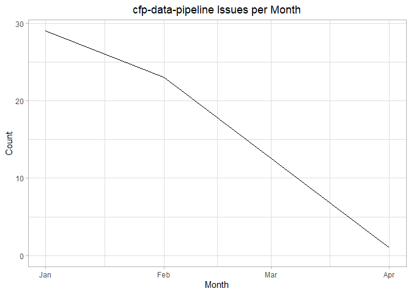
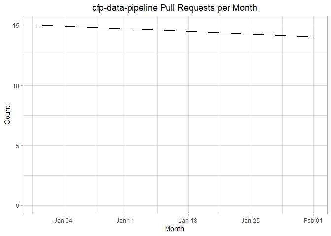

Example Github Analysis for CFP Pipeline
================

### Number of Contributors

``` r
cfp_github_collaborators() %>%
  collect() %>% # pull locally
  # filter(grepl('cfp-data-pipeline', URL, fixed=TRUE))  %>% 
  # mutate(month_created = floor_date(CREATED_AT, "month")) %>% # get day of creation
  # select(ID) %>%
  count() %>%
  rename(Contributors = n)
```

    ## # A tibble: 1 x 1
    ##   Contributors
    ##          <int>
    ## 1           14

### Commits per Date

``` r
## 
cfp_github_commits() %>%
  collect() %>% # pull locally
  filter(grepl('cfp-data-pipeline', COMMENTS_URL, fixed=TRUE))  %>% 
  mutate(day_created = floor_date(COMMIT__AUTHOR__DATE, "day")) %>% # get day of creation
  select('_SDC_REPOSITORY', day_created) %>%
  count(day_created, sort=FALSE) %>%
  rename(Date = day_created, Commits = n)
```

    ## # A tibble: 55 x 2
    ##    Date                Commits
    ##    <dttm>                <int>
    ##  1 2019-12-30 00:00:00       3
    ##  2 2019-12-31 00:00:00       1
    ##  3 2020-01-15 00:00:00       1
    ##  4 2020-01-21 00:00:00       2
    ##  5 2020-01-22 00:00:00       4
    ##  6 2020-01-24 00:00:00       2
    ##  7 2020-01-25 00:00:00       1
    ##  8 2020-01-26 00:00:00       1
    ##  9 2020-01-27 00:00:00       1
    ## 10 2020-01-28 00:00:00       5
    ## # ... with 45 more rows

### Commits per Month

``` r
## days with most commits
cfp_github_commits() %>%
  collect() %>% # pull locally
  filter(grepl('cfp-data-pipeline', COMMENTS_URL, fixed=TRUE))  %>% 
  mutate(month_created = floor_date(COMMIT__AUTHOR__DATE, "month")) %>% # get day of creation
  select('_SDC_REPOSITORY', month_created) %>%
  count(month_created, sort=FALSE) %>%
  rename(Month = month_created, Commits = n)
```

    ## # A tibble: 10 x 2
    ##    Month               Commits
    ##    <dttm>                <int>
    ##  1 2019-12-01 00:00:00       4
    ##  2 2020-01-01 00:00:00      19
    ##  3 2020-02-01 00:00:00      28
    ##  4 2020-06-01 00:00:00       2
    ##  5 2020-07-01 00:00:00       1
    ##  6 2020-08-01 00:00:00       1
    ##  7 2020-10-01 00:00:00       1
    ##  8 2020-12-01 00:00:00      12
    ##  9 2021-01-01 00:00:00      59
    ## 10 2021-02-01 00:00:00      34

``` r
# cfp_github_commits() %>%
#   collect() %>% # pull locally
#   filter(grepl('cfp-data-pipeline', COMMENTS_URL, fixed=TRUE))  %>% 
#   mutate(day_created = floor_date(COMMIT__AUTHOR__DATE, "day")) %>% # get day of creation
#   select('_SDC_REPOSITORY', day_created) %>%
#   count(day_created) %>%
#     ggplot(aes(day_created, n)) + 
#       geom_line() +
#       expand_limits(y=0) + 
#       labs(title="cfp-data-pipeline Commits per day", x="Date", y="Count") +
#       theme_light() + 
#       theme(plot.title = element_text(hjust = 0.5))


cfp_github_commits() %>%
  collect() %>% # pull locally
  filter(grepl('cfp-data-pipeline', COMMENTS_URL, fixed=TRUE))  %>% 
  mutate(month_created = floor_date(COMMIT__AUTHOR__DATE, "month")) %>% # get day of creation
  select('_SDC_REPOSITORY', month_created) %>%
  count(month_created) %>%
    ggplot(aes(month_created, n)) + 
      geom_line() +
      expand_limits(y=0) + 
      labs(title="cfp-data-pipeline Commits per Month", x="Month", y="Count") +
      theme_light() + 
      theme(plot.title = element_text(hjust = 0.5))
```

<!-- -->

### Issues per Month

``` r
cfp_github_issues() %>%
  collect() %>% # pull locally
  filter(grepl('cfp-data-pipeline', COMMENTS_URL, fixed=TRUE))  %>% 
  mutate(month_created = floor_date(CREATED_AT, "month")) %>% # get day of creation
  select('_SDC_REPOSITORY', month_created) %>%
  count(month_created) %>%
  rename(Month = month_created, Issues = n)
```

    ## # A tibble: 3 x 2
    ##   Month               Issues
    ##   <dttm>               <int>
    ## 1 2021-01-01 00:00:00     29
    ## 2 2021-02-01 00:00:00     23
    ## 3 2021-04-01 00:00:00      1

``` r
# cfp_github_issues() %>%
#   collect() %>% # pull locally
#   filter(grepl('cfp-data-pipeline', COMMENTS_URL, fixed=TRUE))  %>% 
#   mutate(day_created = floor_date(CREATED_AT, "day")) %>% # get day of creation
#   select('_SDC_REPOSITORY', day_created) %>%
#   count(day_created) %>%
#     ggplot(aes(day_created, n)) + 
#       geom_line() +
#       expand_limits(y=0) + 
#       labs(title="cfp-data-pipeline Issues per Day", x="Day", y="Count") +
#       theme_light() + 
#       theme(plot.title = element_text(hjust = 0.5))


cfp_github_issues() %>%
  collect() %>% # pull locally
  filter(grepl('cfp-data-pipeline', COMMENTS_URL, fixed=TRUE))  %>% 
  mutate(month_created = floor_date(CREATED_AT, "month")) %>% # get day of creation
  select('_SDC_REPOSITORY', month_created) %>%
  count(month_created) %>%
    ggplot(aes(month_created, n)) + 
      geom_line() +
      expand_limits(y=0) + 
      labs(title="cfp-data-pipeline Issues per Month", x="Month", y="Count") +
      theme_light() + 
      theme(plot.title = element_text(hjust = 0.5))
```

<!-- -->

### Pull Requests Per Month

``` r
cfp_github_pull_requests() %>%
  collect() %>% # pull locally
  filter(grepl('cfp-data-pipeline', URL, fixed=TRUE))  %>% 
  mutate(month_created = floor_date(CREATED_AT, "month")) %>% # get day of creation
  select('_SDC_REPOSITORY', month_created) %>%
  count(month_created) %>%
  rename(Month = month_created, "Pull Requests" = n)
```

    ## # A tibble: 2 x 2
    ##   Month               `Pull Requests`
    ##   <dttm>                        <int>
    ## 1 2021-01-01 00:00:00              15
    ## 2 2021-02-01 00:00:00              14

``` r
# cfp_github_pull_requests() %>%
#   collect() %>% # pull locally
#   filter(grepl('cfp-data-pipeline', URL, fixed=TRUE))  %>% 
#   mutate(day_created = floor_date(CREATED_AT, "day")) %>% # get day of creation
#   select('_SDC_REPOSITORY', day_created) %>%
#   count(day_created) %>%
#     ggplot(aes(day_created, n)) + 
#       geom_line() +
#       expand_limits(y=0) + 
#       labs(title="cfp-data-pipeline Pull Requests per Day", x="Day", y="Count") +
#       theme_light() + 
#       theme(plot.title = element_text(hjust = 0.5))


cfp_github_pull_requests() %>%
  collect() %>% # pull locally
  filter(grepl('cfp-data-pipeline', URL, fixed=TRUE))  %>% 
  mutate(month_created = floor_date(CREATED_AT, "month")) %>% # get day of creation
  select('_SDC_REPOSITORY', month_created) %>%
  count(month_created) %>%
    ggplot(aes(month_created, n)) + 
      geom_line() +
      expand_limits(y=0) + 
      labs(title="cfp-data-pipeline Pull Requests per Month", x="Month", y="Count") +
      theme_light() + 
      theme(plot.title = element_text(hjust = 0.5))
```

<!-- -->
