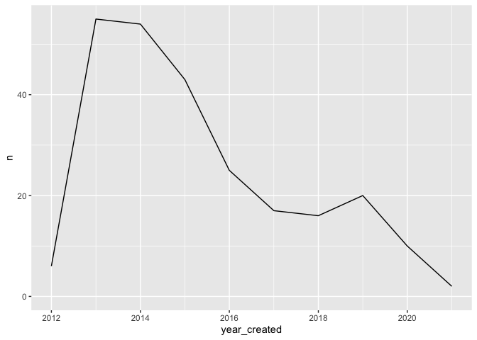
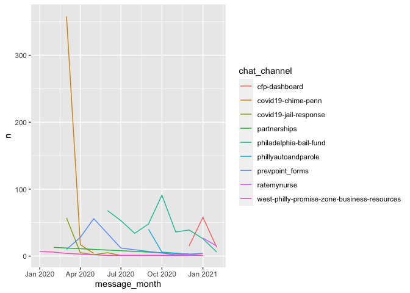
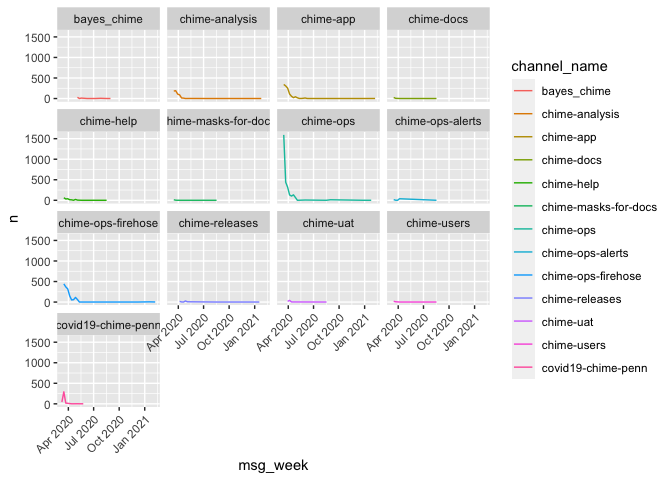

metrics
================

## Project creation date

### Top 10 most recent projects

``` r
cfp_views_laddr_projects() %>%
  arrange(desc(created)) %>%
  head(10) %>%
  select(title, handle, created, chat_channel)
```

    ## # Source:     lazy query [?? x 4]
    ## # Database:   postgres [postgres@161.35.188.229:5678/datawarehouse]
    ## # Ordered by: desc(created)
    ##    title                 handle              created             chat_channel   
    ##    <chr>                 <chr>               <dttm>              <chr>          
    ##  1 RateMyNurse           ratemynurse         2021-01-17 13:38:30 ratemynurse    
    ##  2 Code for Philly Data… code_for_philly_da… 2021-01-05 15:59:16 cfp-dashboard  
    ##  3 Philly Auto and Paro… philly_auto_and_pa… 2020-09-21 15:33:41 phillyautoandp…
    ##  4 Malvern Recycling Re… willistown_townshi… 2020-07-26 18:33:59 <NA>           
    ##  5 Philadelphia Bail Fu… philadelphia_bail_… 2020-06-16 15:33:39 philadelphia-b…
    ##  6 Prevention Point For… prevention_point_f… 2020-05-04 16:17:36 prevpoint_forms
    ##  7 Workforce Impact Ana… workforcephl        2020-04-09 10:11:10 covid19-workfo…
    ##  8 Covid 19 - Jail Resp… covid_19_-_jail_re… 2020-03-21 09:44:04 covid19-jail-r…
    ##  9 CHIME: COVID-19 Hosp… chime               2020-03-14 18:58:10 covid19-chime-…
    ## 10 Computer Vision for … computer_vision_fo… 2020-03-12 13:52:54 prevpoint_forms

### How many projects get created per year?

``` r
# How many projects are created in a given month?
cfp_views_laddr_projects() %>%
  mutate(year_created = floor_date(created, "year")) %>%
  select(title, year_created) %>%
  count(year_created) %>%
  collect() %>%
  mutate(n = as.integer(n)) %>%
  ggplot(aes(year_created, n)) + geom_line() +
  expand_limits(y = 0)
```

<!-- -->

### How many people were creating projects during the 2013 spike?

``` r
cfp_views_laddr_projects() %>%
  filter(created >= "2013-01-01", created < "2014-01-01") %>%
  count(creator_id, sort = TRUE) %>%
  left_join(
    cfp_laddr_people() %>% select(ID, Username),
    c("creator_id" = "ID")
  ) %>%
  arrange(desc(n))
```

    ## # Source:     lazy query [?? x 3]
    ## # Database:   postgres [postgres@161.35.188.229:5678/datawarehouse]
    ## # Ordered by: desc(n), desc(n)
    ##    creator_id       n Username       
    ##         <int> <int64> <chr>          
    ##  1          1       5 chris          
    ##  2          2       4 gBot           
    ##  3         43       4 dw             
    ##  4         29       4 ChristianKunkel
    ##  5        158       3 plusjeff       
    ##  6         19       2 fayemaria      
    ##  7        319       2 jimRsmiley     
    ##  8         35       2 mjumbewu       
    ##  9         25       2 dg_tech91      
    ## 10         32       2 atheken        
    ## # … with more rows

## Project slack activity (for those created in 2020)

``` r
projects_2020 <-
  cfp_views_laddr_projects() %>%
  filter(created > "2020-01-01") %>%
  select(title, chat_channel, users_url, developers_url)

channel_messages <-
  cfp_slack_messages() %>%
  left_join(
    cfp_slack_channels() %>% select(channel_id = id, channel_name = name),
    "channel_id"
  )

project_messages <-
  projects_2020 %>%
  inner_join(
    channel_messages %>% select(channel_name, type, username, text, ts),
    c("chat_channel" = "channel_name")
  )
```

### Total messages sent per project

``` r
project_messages %>%
  count(chat_channel, sort = TRUE)
```

    ## # Source:     lazy query [?? x 2]
    ## # Database:   postgres [postgres@161.35.188.229:5678/datawarehouse]
    ## # Ordered by: desc(n)
    ##   chat_channel                                      n
    ##   <chr>                                       <int64>
    ## 1 philadelphia-bail-fund                          401
    ## 2 covid19-chime-penn                              379
    ## 3 prevpoint_forms                                 112
    ## 4 cfp-dashboard                                    86
    ## 5 covid19-jail-response                            72
    ## 6 phillyautoandparole                              47
    ## 7 ratemynurse                                      42
    ## 8 west-philly-promise-zone-business-resources      21
    ## 9 partnerships                                     16

### Messages per month

``` r
project_messages %>%
  #filter(chat_channel == "philadelphia-bail-fund") %>%
  collect() %>%
  mutate(message_month = floor_date(ts, "month")) %>%
  count(chat_channel, message_month) %>%
  ggplot(aes(message_month, n, color = chat_channel)) + geom_line() 
```

<!-- -->

### Messages across different CHIME project channels

``` r
channel_messages %>%
  filter(channel_name %LIKE% "%chime%") %>%
  mutate(msg_week = floor_date(ts, "week")) %>%
  collect() %>%
  count(channel_name, msg_week, sort = TRUE) %>%
  ggplot(aes(msg_week, n, color = channel_name)) + facet_wrap(~ channel_name) + geom_line() + theme(axis.text.x = element_text(angle = 45, hjust = 1))
```

<!-- -->
